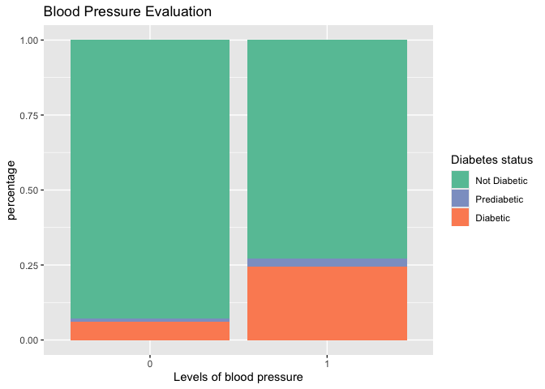
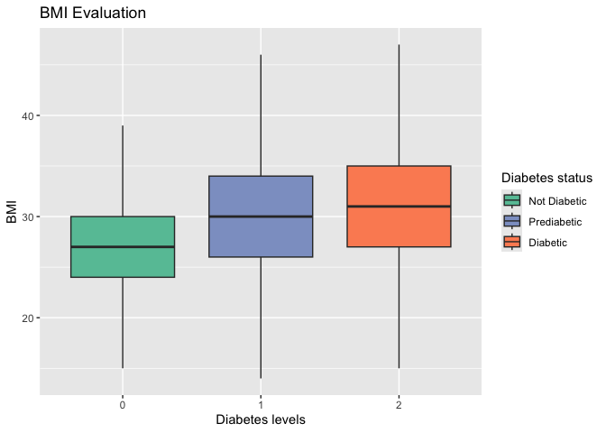
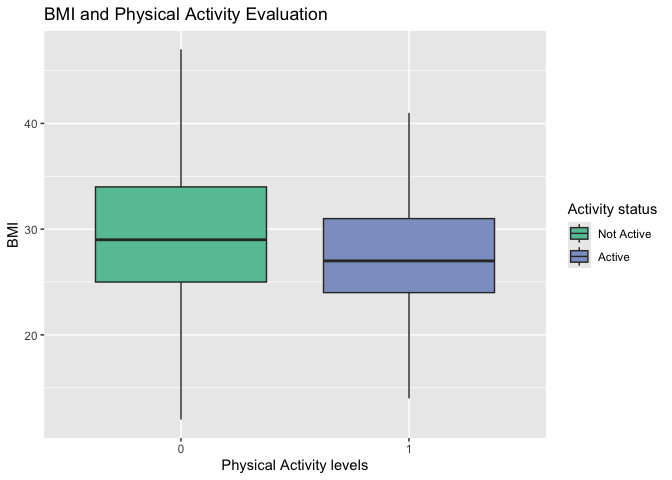
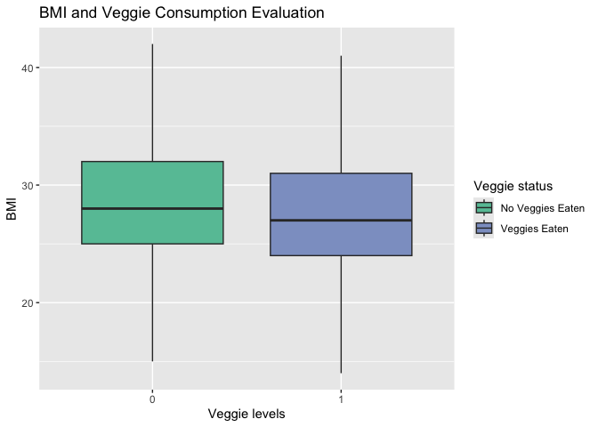
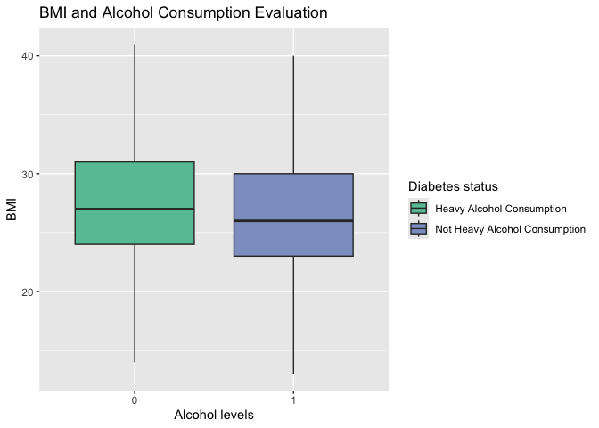
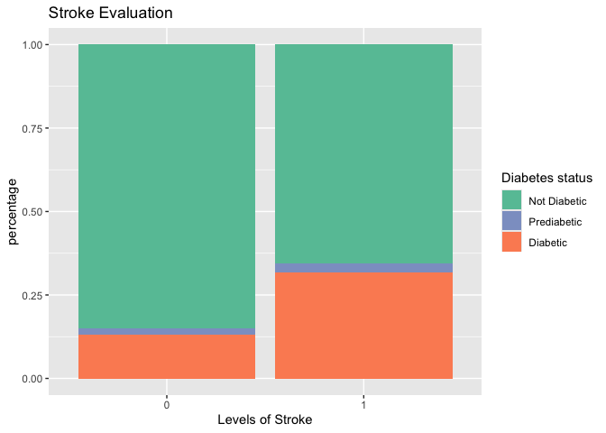
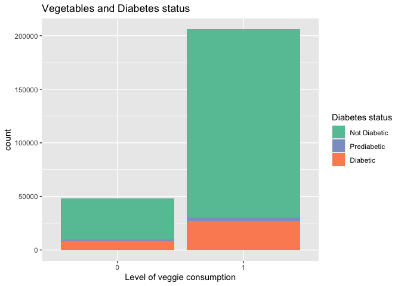
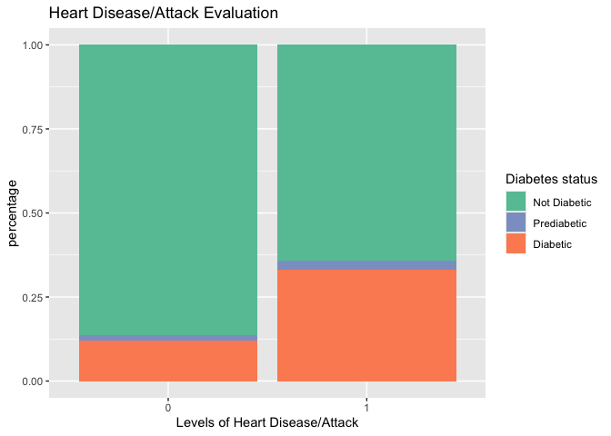
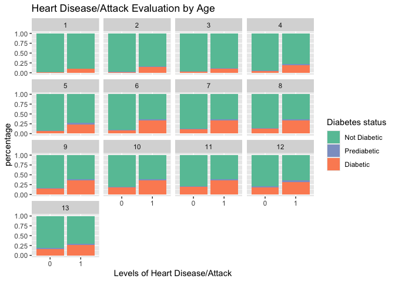
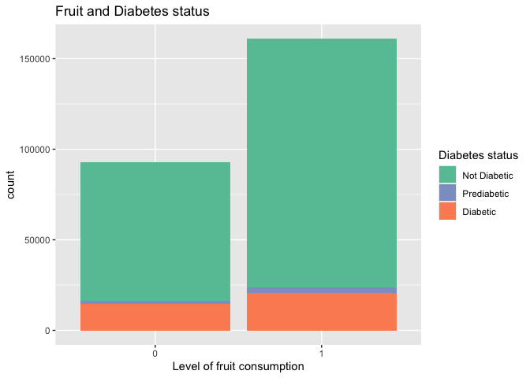

# Impact of Health Factors on Diabetes

## Rose Birkner, Owen Senn

#### Introduction

This project’s goal is to explore and analyze the impact that certain
health and risk factors have on Diabetes. This topic is of interest
because diabetes has been a growing problem in the United States for
years and can usually be prevented by lifestyle choices. It is important
to understand what steps individual’s can take to mitigate and prevent
this disease.

It is important to note that while the survey does not differentiate
between type 1 and type 2 diabetes the vast majority of diabetes cases
are type 2. According to the Centers for Disease Control and Prevention,
“More than 38 million Americans have diabetes (about 1 in 10), and about
90% to 95% of them have type 2 diabetes.” While it is possible to have a
genetic predisposition to diabetes, type 2 is usually preventable
through lifestyle choices.

#### Questions to be addressed

- How do health factors such as blood pressure, cholesterol levels, and
  BMI affect an individuals chances of getting diabetes?
- Is there a relationship between heart disease/attack or stroke and
  diabetes? Does this differ between men and women?
- How do physical activity and diet (eating fruits and vegetables)
  affect the likelihood of getting diabetes? Is one significantly more
  influential than the other?
- What is the relationship between mental health and diabetes? Is poor
  mental health associated with poor physical activity levels and/or
  diet which in turn affects the occurrence of diabetes?

#### Data Description

The data set for this project came from kaggle here:
<https://www.kaggle.com/datasets/alexteboul/diabetes-health-indicators-dataset/data?select=diabetes_012_health_indicators_BRFSS2015.csv>.
That is a cleaned version of a data set which came from another kaggle
project here:
<https://www.kaggle.com/datasets/cdc/behavioral-risk-factor-surveillance-system?select=2015.csv>.
This data comes from the Behavioral Risk Factor Surveillance System
(BRFSS), an annual phone survey conducted by the CDC. Every year the
data is collected from over 400,000 adults across America. The purpose
of the survey is to collect information on possible health indicators of
several chronic diseases as well as to record general health trends.
During the survey, 330 variables are recorded. Among the information
gathered is demographics, physical activity level, diet, chronic
diseases, and more. Our focus for this project is looking at Diabetes
and the related health factors that might indicate the occurrence of it.

Due to the large number of variables and observations, the original data
set would have been impractical to use and unmanageable. Additionally,
because the survey records such a wide variety of information it was
unnecessary to look at variables that weren’t related to the focus of
our project, diabetes. For these reasons we used the more selective
dataset on kaggle, which was much more manageable and included the
variables necessary to look at diabetes and the health factors that
might influence it. On the kaggle project there were three csv files. We
chose to use the file with over 250,000 observations, a variable that
recorded whether someone was diabetic, prediabetic, or had no diabetes,
and 21 other variables. This particular dataset was from the BRFSS
survey conducted in 2015.

#### Data Cleaning

The data set we are using was previously cleaned by Alex Teboul on
Kaggle with the notebook found here:
<https://www.kaggle.com/code/alexteboul/diabetes-health-indicators-dataset-notebook>.
He compacted the data from the original 330 columns to the 22 we have
now. This cleaning renamed columns for readability, removed instances
with NA values, and cleaned up values to have 0 = no and 1 = yes for
binary variables.

All of the categorical variables were of numeric type, so we changed
them all to be factors. In addition, we wanted to combine the Fruits and
Veggies column so that we could look at one variable that reflected
diet. We called this column Fruits_and_Veggies and gave it 3 levels, 2
for an individual that said they eat both fruits and vegetables, 1 for
an individual that eats either fruits or vegetables but not both, and 0
for someone that says they eat neither. The code for those modifications
is below.

``` r
library(tidyverse)

health_data <- read.csv("HealthFactor.csv")

#make categorical variables of type factor
health_data <- health_data %>% 
  mutate(
    Diabetes_012 = as.factor(Diabetes_012),
    HighBP = as.factor(HighBP),
    HighChol = as.factor(HighChol),
    CholCheck = as.factor(CholCheck),
    Smoker = as.factor(Smoker),
    Stroke = as.factor(Stroke),
    HeartDiseaseorAttack = as.factor(HeartDiseaseorAttack),
    PhysActivity = as.factor(PhysActivity),
    Fruits = as.factor(Fruits),
    Veggies = as.factor(Veggies),
    HvyAlcoholConsump = as.factor(HvyAlcoholConsump),
    AnyHealthcare = as.factor(AnyHealthcare),
    NoDocbcCost = as.factor(NoDocbcCost),
    GenHlth = as.factor(GenHlth),
    DiffWalk = as.factor(DiffWalk),
    Sex = as.factor(Sex),
    Age = as.factor(Age),
    Education = as.factor(Education),
    Income = as.factor(Income)
  )
  


#add fruits_and_veggies feature
health_data <- health_data %>% mutate(
  Fruits_and_Veggies = if_else(Fruits == 1 & Veggies == 1, 2,
                               if_else(Fruits == 1 | Veggies == 1, 1, 0)),
  Fruits_and_Veggies = as.factor(Fruits_and_Veggies)
) %>% 
  relocate(
    Diabetes_012:Veggies,
    Fruits_and_Veggies
  )
```

#### Variables

- **Diabetes_012:** categorical variable where 0 is for no diabetes or
  only during pregnancy, 1 is for prediabetes, and 2 is for diabetes.

- **HighBP:** categorical variable where 0 indicates no high blood
  pressure and 1 indicates that an individual has been told they have
  high blood pressure by a doctor, nurse, or other health professional.

- **HighChol:** categorical variable where 0 indicates no high
  cholesterol and 1 indicates that an individual has been told by a
  doctor, nurse or other health professional that their blood
  cholesterol is high.

- **CholCheck:** categorical variable where 0 indicates an individual
  has not had a cholesterol check in the last 5 years and 1 is that they
  have.

- **BMI:** numerical variable of an individual’s body mass index.

- **Smoker:** categorical variable where 0 indicates an individual has
  not smoked at least 100 cigarettes in their life and 1 indicates they
  have.

- **Stroke:** categorical variable where 0 indicates no stroke for an
  individual and 1 indicates they have been told they had a stroke.

- **HeartDiseaseorAttack:** categorical variable where 0 indicates
  respondents that have never reported having coronary heart disease
  (CHD) or myocardial infarction (MI) and 1 indicates they have.

- **PhysActivity:** categorical variable where 0 indicates no physical
  activity in the last 30 days besides an individual’s regular job and 1
  indicates physical activity or exercise during the past 30 days other
  than their regular job.

- **Fruits:** categorical variable where 0 indicates no fruits eaten
  during the day and 1 indicates fruit consumption one or more times per
  day.

- **Veggies:** categorical variable where 0 indicates no vegetables
  eaten during the day and 1 indicates vegetable consumption one or more
  times per day.

- **Fruits_and_Veggies:** categorical variable where 0 indicates no
  fruits or vegetables eaten during the day, 1 indicates eating some
  fruit or some vegetables every day, and 2 indicates eating both fruits
  and vegetables every day.

- **HvyAlcoholConsump:** categorical variable where 1 indicates a heavy
  drinker and 0 is not a heavy drinker. Heavy drinker is defined as
  adult men having more than 14 drinks per week and adult women having
  more than 7 drinks per week.

- **AnyHealthcare:** categorical variable where 1 indicates having any
  kind of health care coverage and 0 is no healthcare coverage.

- **NoDocbcCost:** categorical variable. 1 = yes and 0 = no in response
  to the question “Was there a time in the past 12 months when you
  needed to see a doctor but could not because of cost?”

- **GenHlth:** categorical variable with 5 levels that indicates general
  health. 1 = excellent, 2 = very good, 3 = good, 4 = fair, 5 = poor.

- **MentHlth:** numerical variable that indicates the number of days in
  the last 30 days that the participant’s mental health was not good.

- **PhysHlth:** numerical variable that indicates the number of days in
  the last 30 days that the participant’s physical health was not good.

- **DiffWalk:** categorical variable. 1 = yes and 0 = no in response to
  the question “Do you have serious difficulty walking or climbing
  stairs?”

- **Sex:** categorical variable. 0 = female, 1 = male.

- **Age:** categorical variable with 13 levels that indicate the age
  range of the participant. 1 = 18-24, 2 = 25-29, 3 = 30-34, 4 = 35-39,
  5 = 40-44, 6 = 45-49, 7 = 50-54, 8 = 55-59, 9 = 60-64, 10 = 65-69, 11
  = 70-74, 12 = 75-79, 13 = 80 or older.

- **Education:** categorical variable with 6 levels that indicates
  education level. 1 = never attended or only kindergarten, 2 = grades
  1-8 (Elementary), 3 = grades 9-11 (some high school), 4 = grade 12 or
  GED (high school graduate), 5 = college 1-3 years (some college or
  technical school), 6 = college 4 years or more (college graduate).

- **Income:** categorical variable with 8 levels that indicate income
  level. 1 = less than \$10,000, 2 = less than \$15,000, 3 = less than
  \$20,000, 4 = less than \$25,000, 5 = less than \$35,000, 6 = less
  than \$50,000, 7 = less than \$75,000, 8 = \$75,000 or more

## Results

``` r
library(ggplot2)
```

#### How do health factors such as blood pressure, cholesterol levels, and BMI affect an individuals chances of getting diabetes?

For this question we wanted to observe and analyze how health factors
such as blood pressure and BMI affect the chance of an individual to
have diabetes. This analysis is important to understand the benefit of
living a healthy lifestyle and the consequences that may come if not.
While there are some instances blood pressure levels can be
uncontrollable, most people can mitigate and control their blood
pressure and BMI by living a healthy lifestyle. As a reminder, blood
pressure is a categorical variable where 0 indicates no high blood
pressure and 1 indicates that an individual has been told they have high
blood pressure by a doctor, nurse, or other health professional. BMI is
a numerical variable that represents a person’s body mass index. This
analysis will exam each variable on their own.

First, we can graphically analyze how blood pressure relates to
diabetes.

``` r
health_data |> ggplot(aes(x = HighBP, fill = Diabetes_012)) +
  geom_bar(position = "fill") +
  scale_fill_manual(values = c("#66C2A5", "#8DA0CB","#FC8D62"), labels = c("0" = "Not Diabetic", "1" = "Prediabetic", "2" = "Diabetic")
  ) +
  labs(title = "Blood Pressure Evaluation", x = "Levels of blood pressure", y = "count", fill = "Diabetes status")
```

<!-- -->

From this chart we can see that individuals who have high blood pressure
are way more likely to have diabetes than individuals who do not have
high blood pressure. This difference is major, and important to note and
for people to understand.

Next, we can examine the more controllable of the two variables BMI.

``` r
health_data |>
  ggplot(aes(x = Diabetes_012, y = BMI, fill = Diabetes_012)) + geom_boxplot(outliers = FALSE) + scale_fill_manual(values = c("#66C2A5", "#8DA0CB","#FC8D62"), labels = c("0" = "Not Diabetic", "1" = "Prediabetic", "2" = "Diabetic")) +labs(title = "BMI Evaluation", x = "Diabetes levels", y = "BMI", fill = "Diabetes status")
```

<!-- -->

``` r
geom_boxplot()
```

    ## geom_boxplot: outliers = TRUE, outlier.colour = NULL, outlier.fill = NULL, outlier.shape = 19, outlier.size = 1.5, outlier.stroke = 0.5, outlier.alpha = NULL, notch = FALSE, notchwidth = 0.5, staplewidth = 0, varwidth = FALSE, na.rm = FALSE, orientation = NA
    ## stat_boxplot: na.rm = FALSE, orientation = NA
    ## position_dodge2

From this chart we can see that individuals who have a higher BMI are at
risk for diabetes. Due to this finding, it is important that people try
to remain healthy to protect themselves from a higher BMI or high blood
pressure which can result in diabetes and many other chronic diseases.

Due to BMI being a controllable variable, what can people do to improve
it?

``` r
health_data |>
  ggplot(aes(x = PhysActivity, y = BMI, fill = PhysActivity)) + geom_boxplot(outliers = FALSE) + scale_fill_manual(values = c("#66C2A5", "#8DA0CB","#FC8D62"), labels = c("0" = "Not Active", "1" = "Active")) + labs(title = "BMI and Physical Activity Evaluation", x = "Physical Activity levels", y = "BMI", fill = "Activity status")

health_data |>
  ggplot(aes(x = Fruits, y = BMI, fill = Fruits)) + geom_boxplot(outliers = FALSE) + scale_fill_manual(values = c("#66C2A5", "#8DA0CB","#FC8D62"), labels = c("0" = "No Fruits Eaten", "1" = "Fruits Eaten")) +labs(title = "BMI and Fruit Consumption Evaluation", x = "Fruit levels", y = "BMI", fill = "Fruit status")

health_data |>
  ggplot(aes(x = Veggies, y = BMI, fill = Veggies)) + geom_boxplot(outliers = FALSE) + scale_fill_manual(values = c("#66C2A5", "#8DA0CB","#FC8D62"), labels = c("0" = "No Veggies Eaten", "1" = "Veggies Eaten")) +labs(title = "BMI and Veggie Consumption Evaluation", x = "Veggie levels", y = "BMI", fill = "Veggie status")

health_data |>
  ggplot(aes(x = HvyAlcoholConsump, y = BMI, fill = HvyAlcoholConsump)) + geom_boxplot(outliers = FALSE) + scale_fill_manual(values = c("#66C2A5", "#8DA0CB","#FC8D62"), labels = c("0" = "Heavy Alcohol Consumption", "1" = "Not Heavy Alcohol Consumption", "2" = "Diabetic")) +labs(title = "BMI and Alcohol Consumption Evaluation", x = "Alcohol levels", y = "BMI", fill = "Diabetes status")
```


These charts show that your BMI will decrease by being more active,
eating healthier, and decreasing alcohol use. By doing these things,
people will become healthier which leads them to be much less likely
prone to diabetes. By being heather, blood pressure will also decrease
which also impacts diabetes. This is a specific and actionable plan that
people can take to make sure they are protectcing themselves against
chronic diseases such as diabetes.

#### How do physical activity and diet (eating fruits and vegetables) affect the likelihood of getting diabetes? Is one significantly more influential than the other?

For this question we wanted to look at how diet and physical activity
affect the rates of diabetes and whether prioritizing one over the other
leads to different chances of getting diabetes. In this survey the only
features that pertain to diet are the variables Fruits and Veggies.
Recall from the description of these variables that they are both
categorical with 0 indicating no fruits or vegetables eaten during the
day and 1 indicating fruit or vegetable consumption one or more times
per day. As stated in the data cleaning section, we thought it would be
interesting to combine these two variables so we could easily compare
those who eat both fruits and vegetables at least once per day to those
that only prioritize eating one as well as those who eat neither fruits
nor vegetables. The details of how we defined this variable are in the
data cleaning section. When diet is mentioned we are referring to the
variable Fruits_and_Vegetables.

This first graphic is a look at basic fruit consumption and diabetes as
well basic vegetable consumption and diabetes

``` r
health_data %>% ggplot(aes(x = Fruits, fill = Diabetes_012)) +
  geom_bar() +
  scale_fill_manual(values = c("#66C2A5", "#8DA0CB","#FC8D62"), labels = c("0" = "Not Diabetic", "1" = "Prediabetic", "2" = "Diabetic")
  ) +
  labs(title = "Fruit and Diabetes status", x = "Level of fruit consumption", y = "count", fill = "Diabetes status")

       
health_data %>% ggplot(aes(x = Veggies, fill = Diabetes_012)) +
  geom_bar() +
  scale_fill_manual(values = c("#66C2A5", "#8DA0CB","#FC8D62"),labels = c("0" = "Not Diabetic", "1" = "Prediabetic", "2" = "Diabetic")
  ) +
  labs(title = "Vegetables and Diabetes status", x = "Level of veggie consumption", y = "count", fill = "Diabetes status")
```



We can see from looking at those plots that visualizing the difference
in proportions is difficult. After making this observation, we decided
to go with a percent stacked bar chart to better visualize the
difference in proportions. Those percent stacked bar charts are below.

``` r
health_data %>% ggplot(aes(x = Fruits, fill = Diabetes_012)) +
  geom_bar(position = "fill") +
  scale_fill_manual(values = c("#66C2A5", "#8DA0CB","#FC8D62"), labels = c("0" = "Not Diabetic", "1" = "Prediabetic", "2" = "Diabetic")
  ) +
  labs(title = "Fruit and Diabetes status", x = "Level of fruit consumption", y = "percentage", fill = "Diabetes status")

       
health_data %>% ggplot(aes(x = Veggies, fill = Diabetes_012)) +
  geom_bar(position = "fill") +
  scale_fill_manual(values = c("#66C2A5", "#8DA0CB","#FC8D62"),labels = c("0" = "Not Diabetic", "1" = "Prediabetic", "2" = "Diabetic")
  ) +
  labs(title = "Vegetables and Diabetes status", x = "Level of veggie consumption", y = "percentage", fill = "Diabetes status")
```


This next plot is the combined fruits and vegetables feature compared
with diabetes, which we also plotted as a percent stacked bar chart.

``` r
health_data %>% ggplot(aes(x = Fruits_and_Veggies, fill = Diabetes_012)) +
  geom_bar(position = "fill") +
  scale_y_continuous(labels = scales::comma) +
  scale_fill_manual(values = c("#66C2A5", "#8DA0CB","#FC8D62"), labels = c("0" = "Not Diabetic", "1" =  "Prediabetic", "2" = "Diabetic")) +
  labs(title = "Fruit & Veggies vs Diabetes status", x = "Level of fruit and veggie consumption", y = "percentage", fill = "Diabetes status")
```

<!-- -->

With the percent stacked bar charts we can see much clearer that for
both the fruit and vegetable plot the proportion of those with diabetes
is lower for those that do incorporate fruits and vegetables into their
diet compared to those that do not. Similarly, we see in the combined
fruits and vegetables plot that the rate of diabetes is lower for those
that consume both fruits and veggies on a daily basis than for those
that include only fruits or only veggies on a daily basis. Therefore, a
combination of fruits and vegetables in the diet is associated with a
lower rate of diabetes.

Next we wanted to look at the relationship between physical activity and
diabetes, which we can see in the next plot.

``` r
health_data %>% ggplot(aes(PhysActivity, fill = Diabetes_012)) +
  geom_bar(position = "fill") +
  scale_fill_manual(values = c("#66C2A5", "#8DA0CB","#FC8D62"), labels = c("0" = "Not Diabetic", "1" = "Prediabetic", "2" = "Diabetic")
  ) +
  labs(title = "Physical activity and Diabetes status", x = "Physical activity level", y = "count", fill = "Diabetes status")
```

<!-- -->

compared to the diet variables. While there was a noticeable decline in
the proportion of those with diabetes when looking at those that eat
fruit and/or vegetables compared with those who don’t, we can see from
the plot that there is a much more noticeable difference in the
proportion of those with diabetes between those who are physically
active and those who are not. This suggests that physical activity could
potentially have a bigger impact on diabetes than diet does. The next
graph looks at the relationship between diet, physical activity and
diabetes together.

``` r
health_data %>% mutate(
  Fruits_and_Veggies = factor(Fruits_and_Veggies, levels = c(0, 1, 2), labels = c("none", "fruits or veggies", "fruits and veggies"))
) %>% ggplot(aes(x = PhysActivity, fill = Diabetes_012)) +
  facet_wrap(~ Fruits_and_Veggies) +
  geom_bar(position = "fill") +
  scale_fill_manual(values = c("#66C2A5", "#8DA0CB","#FC8D62"),labels = c("0" = "Not Diabetic", "1" = "Prediabetic", "2" = "Diabetic")
  ) +
  labs(title = "Diet, Physical Activity and Diabetes status", x = "Physical activity level", y = "Percentage", fill = "Diabetes status")
```

<!-- -->

Here we can see that even for those with a poor diet (eating neither
fruits nor vegetables) including physical activity into their lifestyle
could significantly decrease their chances of developing diabetes. Not
surprisingly, the category with the lowest proportion of diabetics is
the category that both incorporates fruits and vegetables into their
diet regularly and are physically active.

While it is true that those with a good diet who are physically active
have the lowest rates of diabetes, it seems that the dominating factor
here is physical activity. Diet definitely plays a role in this based on
the first graphs we looked at, but physical activity seems to have a
slightly more noticeable affect.

#### What is the relationship between mental health and diabetes? Is poor mental health associated with poor physical activity levels and/or diet which in turn affects the occurrence of diabetes?

To answer this question we first looked at the relationship between
mental health and diabetes with a histogram and a box plot. When we
first made these visualizations we saw that an overwhelming number of
respondents said they had zero days of poor mental health in the past
month. This made it difficult to read and interpret the rest of the
data. We made the decision to exclude those who had zero days of poor
mental health from these visualizations so that we were only looking at
the set of people from the survey who had experienced some amount of
poor mental health. For the remainder of exploration for this question
we will only be looking at those with at least one day of poor mental
health. Below are the first two plots.

``` r
health_data %>% filter(
  MentHlth != 0
) %>% ggplot(aes(x = MentHlth, fill = Diabetes_012)) +
  geom_histogram(color = "black") +
  scale_fill_manual(values = c("#66C2A5", "#8DA0CB","#FC8D62"), labels = c("0" = "Not Diabetic", "1" = "Prediabetic", "2" = "Diabetic")
  ) +
  labs(title = "Days of Poor Mental Health and Diabetes Level",x = "Num days poor mental health in last 30 days", y = "count", fill = "Diabetes status")


health_data %>% filter(
  MentHlth != 0
) %>% 
  ggplot(aes(x = Diabetes_012, y = MentHlth, fill = Diabetes_012)) +
  geom_boxplot(staplewidth = 1) +
  scale_fill_manual(values = c("#66C2A5", "#8DA0CB","#FC8D62"), labels = c("0" = "Not Diabetic", "1" = "Prediabetic", "2" = "Diabetic")
  ) +
  labs(title = "Days of Poor Mental Health and Diabetes Level", x = "Diabetes level", y = "Num days poor mental health in last 30 days", fill = "Diabetes status")
```


Some interesting observations can be made from these plots. In the
histogram we can see that there is a spike of responses at about five or
less days of poor mental health. after this spike we see the number of
responses slowly declining as the number of days increases. At 30 days
however, we see another spike of responses which includes the highest
count of diabetes across all days in the graph. The boxplot shows
something very similar. Those without diabetes have the lowest median
for number of poor mental health days, those who are prediabetic tended
to report a higher number of days and have a higher median, and finally,
those who are diabetic tended to report the highest number of poor
mental health days and have the highest median.

These plots suggest that there is a relationship between mental health
and diabetes. However, they may not be directly related. Something else
we wanted to explore in this question was whether or not mental health
was related to some other factors that in turn would cause diabetes. In
this next plot we look at the relationship between mental health and
diet to see if diet could possibly be a link between mental health and
diabetes.

``` r
health_data %>% filter(
  MentHlth != 0
) %>% ggplot(aes(x = MentHlth, fill = Fruits_and_Veggies)) +
  geom_histogram(color = "black") +
  scale_fill_manual(values = c("#e78ac3", "#a6d854","#ffd92f"), labels = c("0" = "No Fruits or Veggies", "1" = "Some Fruits or Veggies", "2" = "Both Fruits and Veggies")
  ) +
  labs(title = "Days of Poor Mental Health and Diet", x = "Num days poor mental health in last 30 days", y = "count", fill = "Quality of Diet")
```

    ## `stat_bin()` using `bins = 30`. Pick better value with `binwidth`.

<!-- -->
